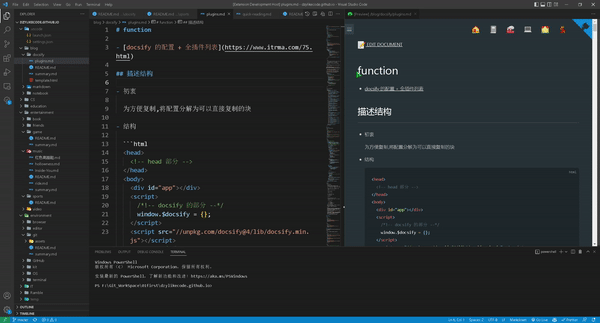

# docsify Preview

- market: https://marketplace.visualstudio.com/items?itemName=dzylikecode.docsify-preview
- online docs: https://dzylikecode.github.io/VSCodeExt-docsify-Preview/#/

[docsify](https://docsify.js.org/#/) is a magical documentation site generator. What the plugin does is to help you see the preview of your markdown file when writing it so that you can get a better feedback. What you see is what you get.

## Features

- preview docsify in the side bar

  

- auto scroll when markdown file scrolled

  

- auto jump to the corresponding position when open a markdown file

  

- auto reload when markdown file saved

  

- context menu

  - Open in browser

  - go here

    

If you are interested in my docsify template, welcome to visit my [docsify-template](https://dzylikecode.github.io/#/blog/docsify/?id=template), which supports mindmap, math formula, mermaid, jsRunkit and so on.

If you want to paste images in markdown, welcome to use my another plugin:[md-paste-enhanced](https://marketplace.visualstudio.com/items?itemName=dzylikecode.md-paste-enhanced).

> If you like this plugin, please give me a star. Thanks!

## Extension Settings

- `docsifyPreview.port`: set the port of the server

  - Default value is `10812`

- `docsifyPreview.indexFile`: Set Custom index file of Live Server.

  To change index file, use '/' and relative path from workspace.

  - Example: `/index.html`

  - Default value is `/docs/index.html`

## Known Issues

I have fixed all the issues I met. If you find any issues, please report it to [issue](https://github.com/dzylikecode/VSCodeExt-docsify-Preview/issues)

The scroll will be in the wrong position when you save the markdown file if the current markdown file can't be found in the sidebar. I find the reason is that Docsify won't execute the function `hook.ready` if the Markdown file is not in the sidebar. So you'd better add the markdown file to the sidebar first before writing the Markdown file with joy.

## Release Notes

### 1.1.0

- fix:

  - open in browser

    it will open the wrong link if you change the page in the preview

  - the title doesn't respond when you change the page in the preview

- refactor code

### 1.0.0

🎉 🎉 🎉

- [x] fix: the scroll position will be put at the wrong position when openning the `docsify Preivew` the first time
- [x] change: use the context menu to open the preview in browser instead of right-click
- [x] add: the button "go here" in the context menu

  If you click the button, the vscode will open the corresponding markdown and scroll to the same position.

- [x] fix: the state of whether sidebar is closed will be reset if you reload the window

### 0.2.2

@paulhibbitts

fix: An annoying bug that you have to drag the next markdown to the side bar to see the preview.

### 0.2.1

change the label of menu to "Show Docsify preview to the side"

> Thanks to @paulhibbitts

### 0.2.0

feature: right-click the preview will open the preview in the default browser

### 0.1.0

feature: add input box if configuration is not correct

### 0.0.1

congratulations!

- [x] scroll sync
- [x] reload automatically when saving markdown
- [x] jump to the corresponding link automatically when switching the markdown

## buy me a coffee :coffee:

I'm a student from China and I sacrificed the entire National Day holiday to write this plugin(Not only that, I also overdrawn five days of study😰). If you like this plugin, please give me a star. If you want to buy me a coffee, scan the QR code below. Thanks! 😝 😝 😝

|                           PayPal                           |            WeChat Pay            |            Alipay             |
| :--------------------------------------------------------: | :------------------------------: | :---------------------------: |
| [dzylikecode](https://www.paypal.com/paypalme/dzylikecode) |  |  |

## backers

Thank you very much!!!

@paulhibbitts
