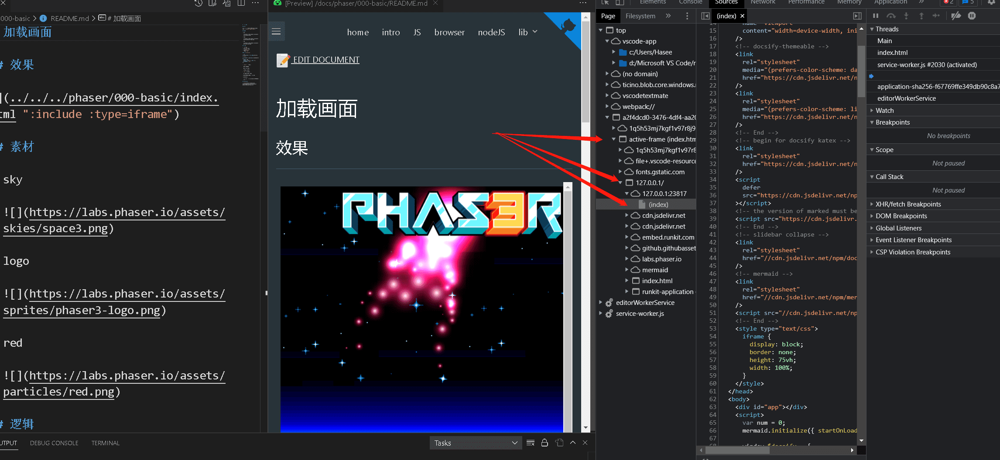

# Docsify Preview

- market: https://marketplace.visualstudio.com/items?itemName=dzylikecode.docsify-preview
- online docs: https://dzylikecode.github.io/VSCodeExt-docsify-Preview/#/

[Docsify](https://docsify.js.org/#/) is a magical documentation site generator. What the plugin does is help you see the preview of your markdown file when writing it so that you can get better feedback. What you see is what you get.

## Features

- preview Docsify in the sidebar

  

- auto scroll when markdown file scrolled

  

- auto jump to the corresponding position when opening a markdown file

  

- auto-reload when the markdown file saved

  

- preview: context menu

  - Open in browser

  - go here

    

  - open develop tools

    

    > the hint to find your source file in the developer tools

  - close preview

- editor: context menu

  - docsify: open/close the side preview
  - docsify: open the full preview

If you are interested in my Docsify template, welcome to visit my [Docsify-template](https://dzylikecode.github.io/#/blog/docsify/?id=template) or fork this [repo](https://github.com/dzylikecode/template-docsify), which supports mindmap, math formula, mermaid, jsRunkit, and so on.

If you want to paste images in markdown, welcome to use my other plugin:[md-paste-enhanced](https://marketplace.visualstudio.com/items?itemName=dzylikecode.md-paste-enhanced).

> If you like this plugin, please give me a star. Thanks!

## Extension Settings

- `docsifyPreview.port`: number

  Set the port of the server

  - the default value is `10812`

- `docsifyPreview.indexFile`: string

  Set the path of your custom `index.html`

  To change the path, use `/` refer to the relative path from the workspace.

  - Example: `/index.html`

  - the default value is `/docs/index.html`

- `docsifyPreview.followLinkWithCtrl`: boolean

  Set whether to open the link with `Ctrl` pressed

  - the default value is `false`

## Shortcuts

- `Ctrl+Shift+A`: open/close the side preview
- `Ctrl+Shift+V`: open the full preview

## skills

- full preview (`Ctrl+Shift+V`) => open the markdown from the preview (`go Here`) => show the markdown to the side (`Ctrl+Shift+A`)
- close the full preview (`Ctrl+W`)

## Known Issues

You may open the duplicate tab in the browser if clicking the external link.

If you find any issues, please report them to [issue](https://github.com/dzylikecode/VSCodeExt-docsify-Preview/issues)

## Release Notes

### 1.7.0

- refactor the code
- +:shortcut `ctrl+alt+a`: open/close the side preview
- +:shortcut `ctrl+alt+v`: open the full preview
- follow the link with `ctrl` pressed

  this may help you get rid of the annoying popup window if enabled

### 1.6.0

fixed: failed to open an external link

> Now you can open the external link in the preview, and then it will be opened in the browser. But the problem is that you may open the duplicate tab in the browser. I will try to fix it in the future.

### 1.5.0

- feature:

  - the context menu of the preview

    - add: close preview

    - right-click the button will trigger the same event as clicking it.

  - the context menu of the editor

    - add: show Docsify preview to the side

- fix:

  prevent the origin context menu when right-clicking the context menu

### 1.4.0

- feature:

  - context menu

    open develop tools

### 1.3.0

- fix:

  - need to reload the VSCode if the `index.html` is changed

    now, you can just reopen the Docsify-Preview to make it work

- change

  pretty context menu

### 1.2.0

fix: issue

see more detail at https://github.com/dzylikecode/VSCodeExt-docsify-Preview/pull/11

### 1.1.0

- fix:

  - open in browser

    it will open the wrong link if you change the page in the preview

  - the title doesn't respond when you change the page in the preview

- refactor code

### 1.0.0

🎉 🎉 🎉

- [x] fix: the scroll position will be put at the wrong position when opening the `Docsify Preview` the first time
- [x] change: use the context menu to open the preview in a browser instead of right-clicking
- [x] add: the button "go here" in the context menu

  If you click the button, the VSCode will open the corresponding markdown and scroll to the same position.

- [x] fix: the state of whether the sidebar is closed will be reset if you reload the window

### 0.2.2

@paulhibbitts

fix: An annoying bug is that you have to drag the next markdown to the sidebar to see the preview.

### 0.2.1

change the label of the menu to "Show Docsify preview to the side"

> Thanks to @paulhibbitts

### 0.2.0

feature: right-click the preview will open the preview in the default browser

### 0.1.0

feature: add input box if the configuration is not correct

### 0.0.1

congratulations!

- [x] scroll sync
- [x] reload automatically when saving markdown
- [x] jump to the corresponding link automatically when switching the markdown

## buy me a coffee :coffee:

I'm a student from China and I sacrificed the entire National Day holiday to write this plugin(Not only that, but I also overdrawn five days of study😰). If you like this plugin, please give me a star. If you want to buy me a coffee, scan the QR code below. Thanks! 😝 😝 😝

|                           PayPal                           |            WeChat Pay            |            Alipay             |
| :--------------------------------------------------------: | :------------------------------: | :---------------------------: |
| [dzylikecode](https://www.paypal.com/paypalme/dzylikecode) |  |  |

## backers

Thank you very much!!!

@paulhibbitts
