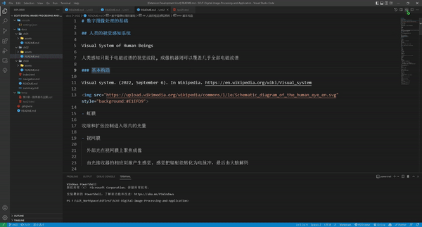

# docsify Preview

- online docs: https://dzylikecode.github.io/VSCodeExt-docsify-Preview/#/

[docsify](https://docsify.js.org/#/) is a magical documentation site generator. What the plugin does is to help you see the preview of your markdown file when writing it so that you can get a better feedback. What you see is what you get.

## Features

- preview docsify in the side bar

  

- auto scroll when markdown file scrolled

  

- auto jump to the corresponding position when open a markdown file

  

- auto reload when markdown file saved

  

If you are interested in my docsify template, welcome to visit my [docsify-template](https://dzylikecode.github.io/#/blog/docsify/?id=template), which supports mindmap, math formula, mermaid, jsRunkit and so on.

If you want to paste images in markdown, welcome to use my another plugin:[md-paste-enhanced](https://marketplace.visualstudio.com/items?itemName=dzylikecode.md-paste-enhanced).

> If you like this plugin, please give me a star. Thanks!

## Extension Settings

- `docsifyPreview.port`: set the port of the server

  - Default value is `5500`

- `docsifyPreview.indexFile`: Set Custom index file of Live Server.

  To change index file, use '/' and relative path from workspace.

  - Example: `/index.html`

  - Default value is `/docs/index.html`

- `docsifyPreview.rightClickOpenInBrowser.enable`: right click will open the preview in browser if enable

  - Default value is `true`

## Known Issues

The scroll will be put at the wrong position when openning the `docsify Preivew` the first time. So you must scroll the markdown slightly to make the scroll at the right position. Hope this issue will be fixed in the future, and you are tolerant to this issue.

> I can't stand it. 😭 😭 😭

## Release Notes

### 0.2.0

feature: right click will open the preview in browser

### 0.1.0

feature: add input box if configuration is not correct

### 0.0.1

congratulations!

- [x] scroll sync
- [x] reload automatically when saving markdown
- [x] jump to the corresponding link automatically when switching the markdown

**Enjoy!**
