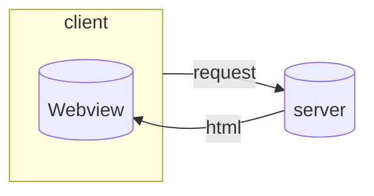
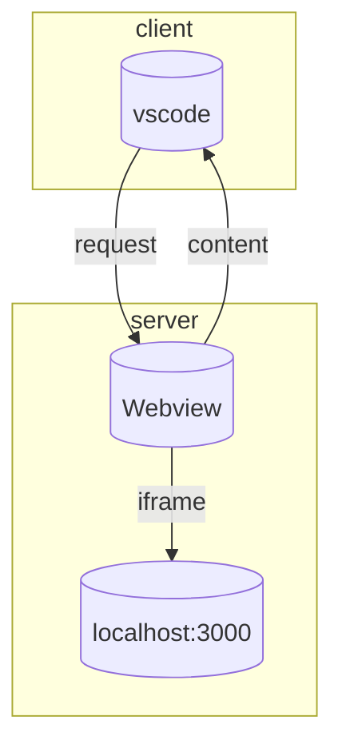
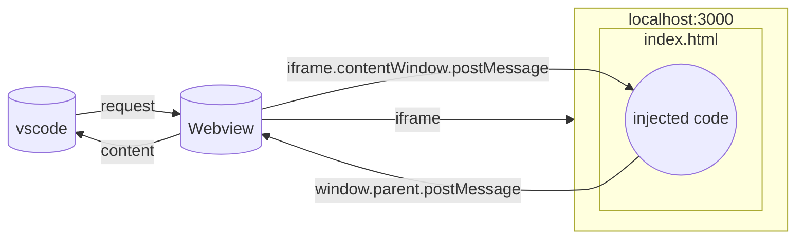
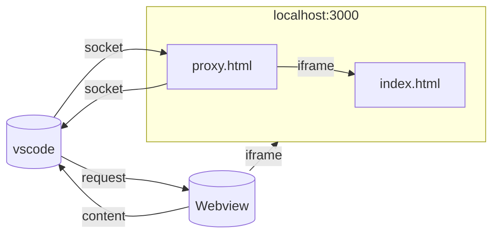
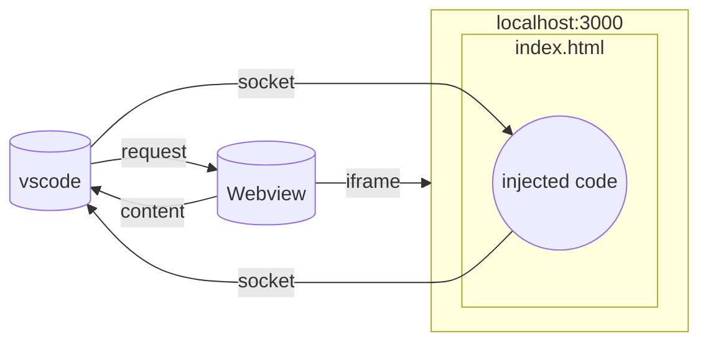
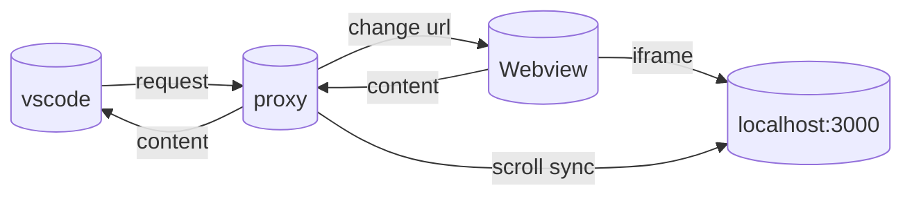
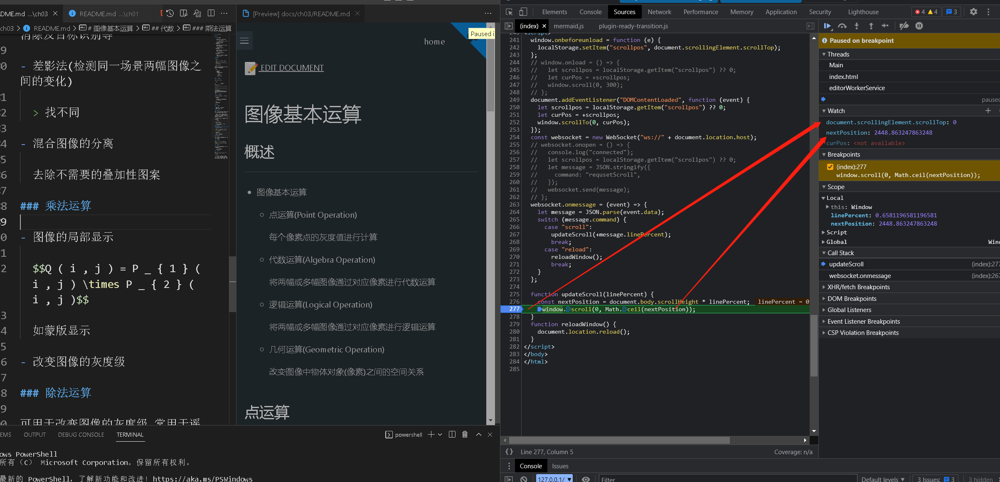
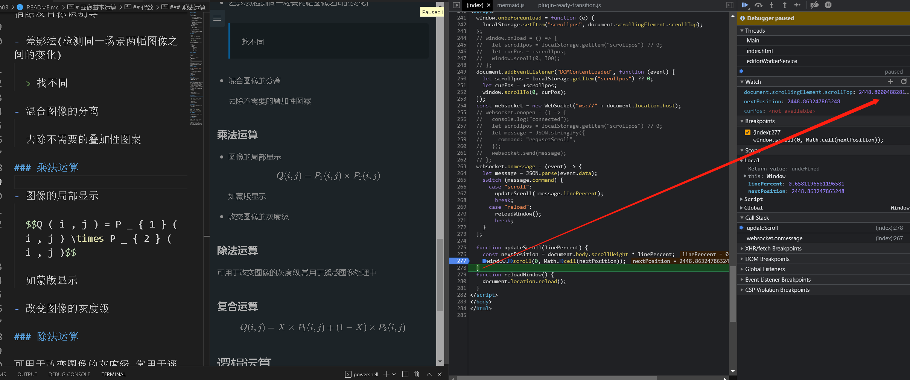
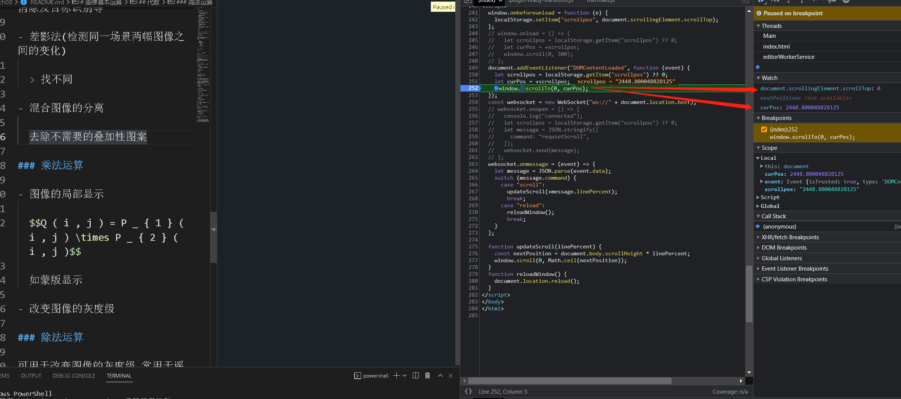
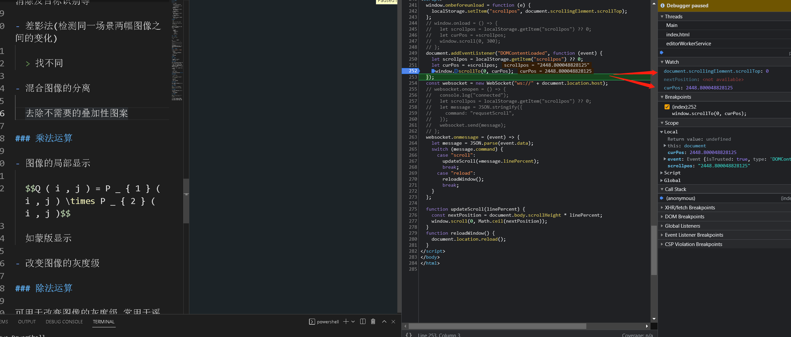

# code

- :x: 表示不可行
- :heavy_check_mark: 表示可行
- :mag: 表示有待研究

## 基本概念

- [Webview API](https://code.visualstudio.com/api/extension-guides/webview)

  一个可以渲染 Html 的窗口

## 模型

当前模型: [model-7](#model-7)

### model-1

- :x:

直接将 docsify 的`index.html`传递给 Webview, 由于安全权限, 有大量的 js, css 文件(本地的或远程的)无法加载

需要原来的路径(orginPath)进行`vscode.Uri.file(originPath)`替换

### model-2

- :x:

inspired by:[How to Build a VS Code extension for Markdown preview using Remark processor](https://dev.to/salesforceeng/how-to-build-a-vs-code-extension-for-markdown-preview-using-remark-processor-1169)

- server

  以 docsify 的`index.html`为入口, 建议一个服务端`server`, 不妨设为`http://localhost:3000`

- Webview

  把 Webview 看作客户端一部分



> 基本思路是爬取渲染后的 html 代码, 结果没有成功, 详见[request-失败](#request-失败)

### model-3

- :x:

inspired by:

- [HTTP Server / HTML Preview](https://marketplace.visualstudio.com/items?itemName=Flixs.vs-code-http-server-and-html-preview)
- [vscode-vs-browser](https://github.com/Phu1237/vscode-vs-browser)

> 核心: 通过 iframe 来解析 server 端的 html

模型转变: 将 Webview 看作服务端的一部分, vscode 看作是客户端



!> 无法控制 iframe 的元素, 比如说 scroll, 详见[cross-origin](#cross-origin)

- 收获

  - 实现了页面自动跳转

    > 可以通过控制 iframe 的链接来进行页面跳转

    当打开 vscode 上面的`/ch03/README.md`, 只需要设定`iframe.src=https://localhost:3000/#/ch03/README.md`即可让 Webview 显示对应的渲染网页

### model-4

- :mag:

inspired by:

- [Cross domain postMessage, identify iFrame](https://stackoverflow.com/questions/23629421/cross-domain-postmessage-identify-iframe)
- [Communication between an iframe and its parent window](https://htmldom.dev/communication-between-an-iframe-and-its-parent-window/)

> 核心: 在 docsify 的`index.html`中植入`postMessage`的代码



> 我不知道为什么不起作用, 就是 iframe 没有接收到消息, 我没有深入研究 :confounded: :confounded: :confounded:

我发现由 iframe 发送消息给父窗口是可行的, 之前不行是因为没有添加`'*'`参数, 而父窗口发送给 iframe, 我好像也是没有添加`'*'`参数, 此参数的含义参见[MDN Window.postMessage()](https://developer.mozilla.org/en-US/docs/Web/API/Window/postMessage)

```js
window.parent.window.postMessage(
  {
    command: "contextmenu",
  },
  "*"
);
```

### model-5

- :mag:

inspired by [HTTP Server / HTML Preview](https://marketplace.visualstudio.com/items?itemName=Flixs.vs-code-http-server-and-html-preview)

> 核心: 采用 WebSocket 进行通信



> 采用了`proxy.html`iframe`index.html`的方式, `proxy.html`和`index.html`是`the same origin`, 可以访问`iframe.contenWindow.document`

!> 但是无法使用`http://localhost:3000/#/ch03/README.md`的方式进行跳转, 所有的链接与`http://localhost:3000/`内容相同, 原因是我的`proxy.html`没有对`#/ch03/README.md`的处理, 我不会处理 :confounded: :confounded: :confounded:

### model-6

- :heavy_check_mark: -> 0.0.1 - 0.2.2

inspired by [live-server](https://github.com/ritwickdey/vscode-live-server)

> 直接 inject 一段代码到`index.html`



> 采用 proxy 设计模式



> 碰到问题[reload-时-scroll-不起作用](#reload-时-scroll-不起作用)

## model-7

- :heavy_check_mark: -> 1.0.0 - now

结合了 [model-5](#model-5) 和 [model-6](#model-6)

> 将 vscode 与 html 的 message 传递分成了两类

- websocket

  message:

  - markdown saved

- iframe

  message:

  - scroll sync
  - open the external link

## feature

### open in browser

- :heavy_check_mark:

- [Test finalized webview context menu api](https://github.com/microsoft/vscode/issues/161848)

  还在测试阶段

!> context menu 是和 document 绑定的, 所以在`iframe`中捕捉消息

如果在 iframe 中处理 contextmenu 信号, 将导致打开浏览器时候, 也会处理到 contextmenu 信号, 所以, 应该将信号转发给父窗口, 然后打开外部链接

- 参考链接

  - [How to add a custom right-click menu to a webpage?](https://stackoverflow.com/questions/4909167/how-to-add-a-custom-right-click-menu-to-a-webpage)

  - [Adding to browser context menu?](https://stackoverflow.com/questions/4447321/adding-to-browser-context-menu)

  - [How to add a custom right-click menu to a webpage ?](https://www.geeksforgeeks.org/how-to-add-a-custom-right-click-menu-to-a-webpage/)

    尝试了, 不合适

  - [Building a Custom Right-Click (Context) Menu with JavaScript](https://www.sitepoint.com/building-custom-right-click-context-menu-javascript/)

    - Demo: https://codepen.io/SitePoint/pen/MYLoWY

    似乎不错, 但是我没时间去画右键菜单了

简单使用右键即打开网页

### editor syncs with preview

> see details [here](https://github.com/dzylikecode/VSCodeExt-docsify-Preview/pull/9)

## issue

### request-失败

- :mag:

用 express 搭建了一个服务端`http://localhost:3000`

- 想直接通过 express 获取渲染后的 html

  > 不会 :sob: :sob: :sob:, 我搜了很多, 都没搜到类似的问题(I don't know how to explain the issue because my English is far from perfect.)

- 用爬虫技术

  - 用`request`请求`http://localhost:3000`, `http://localhost:3000/#/`, 返回的都是 502,请求失败

  - 用`curl` get nothing

  - 尝试`request`GitHub 建立好的网页, 比如我的 blog: https://dzylikecode.github.io/#/, 但是返回的是`index.html`的源码, 而不是渲染后的 html 代码

  > 重要的是, 用浏览器是可以访问`http://localhost:3000`的, 但是用`request`就不行

### cross-origin

- :x:

引用`iframe.contentWindow.document`会报错如下

```txt
Uncaught DOMException: Blocked a frame with origin "vscode-webview://19phs4cus40ic26q2jiibe80p036ukca36l2hblkvpa9bnq8dv7g" from accessing a cross-origin frame.
```

- 参考链接

  - [What I've learned so far while bringing VS Code's Webviews to the web](https://blog.mattbierner.com/vscode-webview-web-learnings/)

    > 它似乎认为不可能直接访问, 因为 Webview 的 origin 是`vscode-webview://`, 而 iframe 的是`http://`这必然是 cross-origin

  - [Solve the Cross-Origin Access error when working with iframes](https://www.anirudhv.xyz/solve-cross-origin-iframe-error/)

    > 看到需要改电脑的 host, 我就直接放弃

  - [Get DOM content of cross-domain iframe [duplicate]](https://stackoverflow.com/questions/6170925/get-dom-content-of-cross-domain-iframe)

    > `stack overflow`回答了, 这基本上是不可能的

### reload-时-scroll-不起作用

- :heavy_check_mark:

- 当 scroll scrollbar 时可以正常同步

  |               执行前                |               执行后                |
  | :---------------------------------: | :---------------------------------: |
  |  |  |

- 当 reload 的时候, the position of scrollbar 不正确

  |               执行前                |               执行后                |
  | :---------------------------------: | :---------------------------------: |
  |  |  |

> 这是因为在 window.onload 的时候, docsify 还没有被渲染, 所以 window 的滚动条的范围实际上很小, 基本上为 0

- 解决方法

  在 docsify 加载完后进行 scroll

  - 采用延时函数,等 docsify 加载

    > 感觉不太稳定

  - 在 docisfy 加载完的时候执行

    :sparkles: :sparkles: :sparkles:

    > 通过插件的形式植入到 docsify 中, 在 docsify 的 `hook.ready` 中执行

### docsify-插件-ready

- 同级目录下没有对应 sidebar 文件的 markdown, 链接是不会执行 docsify 的 hook.ready 函数, 所以滚动条会滚动失败

> 可以尝试使用 hook.mounted 来代替 hook.ready(不可以, 完全失效), 只能添加一个空的 sidebar 文件

### setConfiguration

执行以下代码

```js
vscode.workspace
  .getConfiguration("docsifyPreview")
  .update("indexFile", newPath, false);
```

然后在`settings.json`中查看, 发现没有更新, 需要过一段时间, 即里面执行下面的代码

```js
vscode.workspace.getConfiguration("docsifyPreview").indexFile;
```

并没有获得立马更新的值
